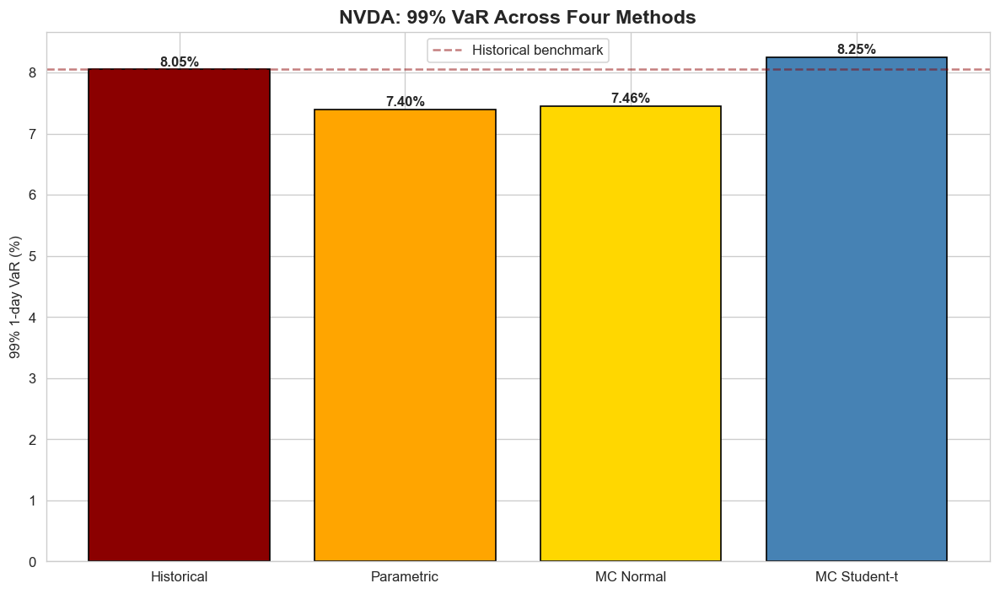
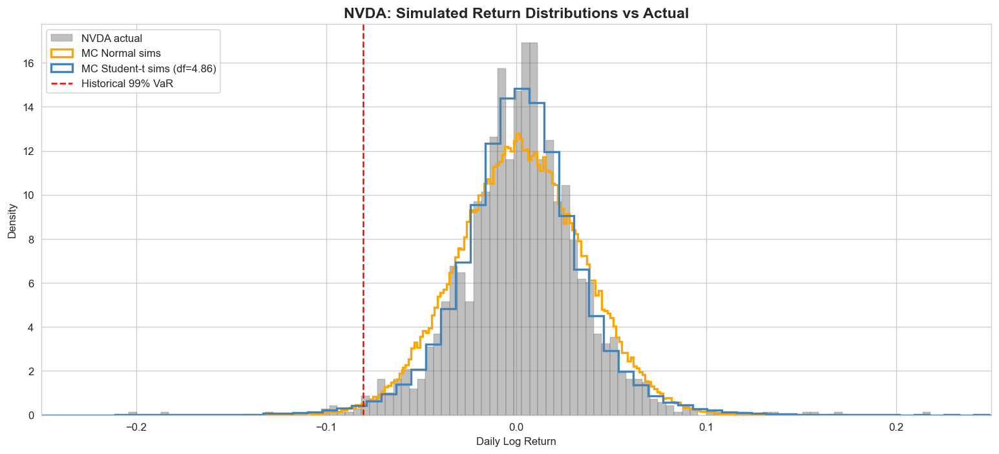
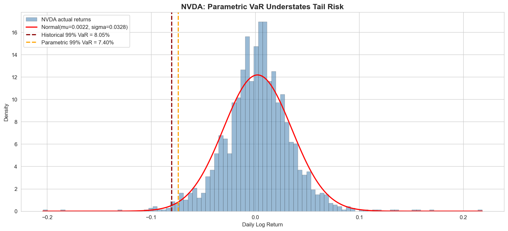
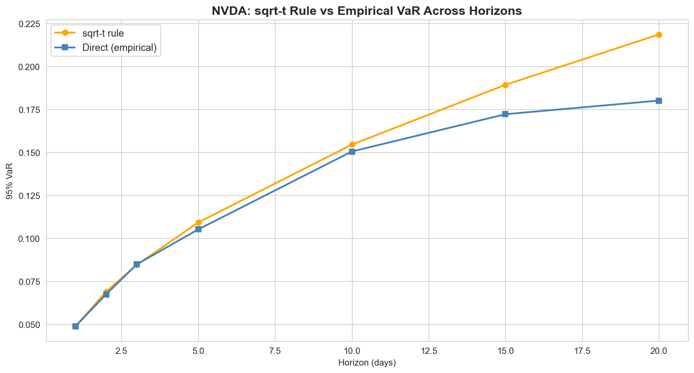
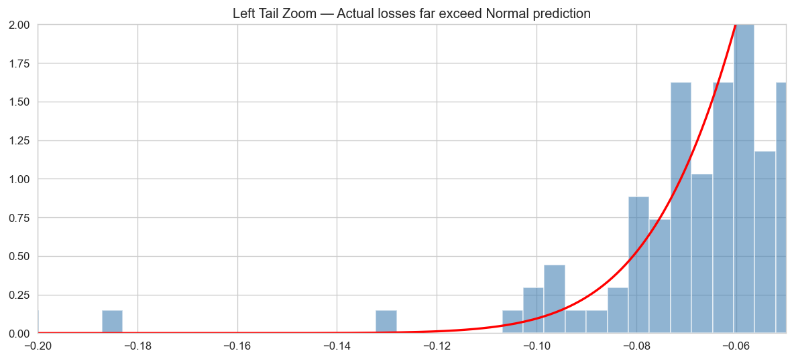
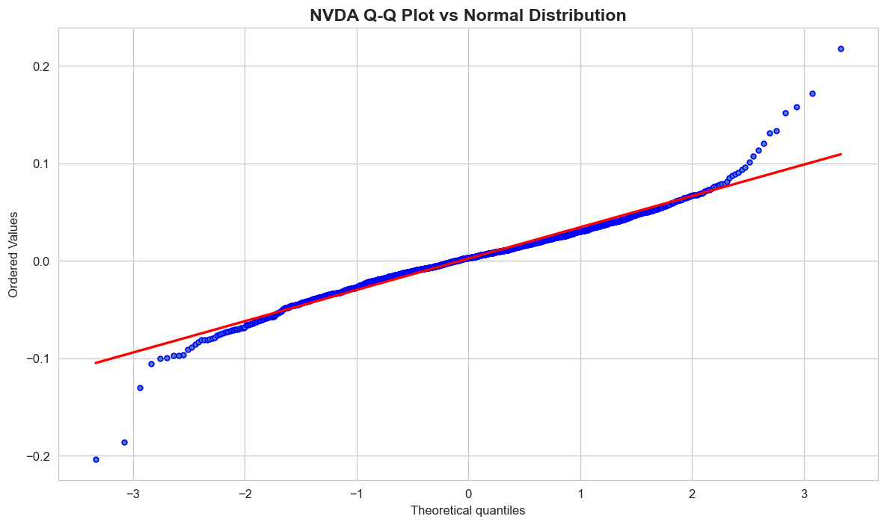

# var-engine — Value at Risk for NVDA

A from-scratch **Value at Risk (VaR)** and **Conditional VaR / Expected Shortfall (CVaR)**
engine, implementing four methodologies side by side and stress-testing them against
six years of NVIDIA (NVDA) returns. Built to answer one question honestly: *how much can
you lose on a bad day, and which model tells you the truth about the deep tail?*



---

## Headline finding

**The normal distribution underprices NVDA's tail risk — and the gap only shows up in the deep (99%) tail.**

At the 95% level all four methods roughly agree (~4.8–5.2%). But at 99%, the two
normal-based methods fall *below* the fat-tailed ones:

| Method | 95% 1-day VaR | 99% 1-day VaR |
|---|---:|---:|
| Historical (empirical) | 4.89% | **8.05%** |
| Parametric (Variance–Covariance, Normal) | 5.17% | 7.40% |
| Monte Carlo — Normal | 5.21% | 7.46% |
| Monte Carlo — Student-t (df fitted by MLE) | 4.83% | **8.25%** |

The empirical and Student-t models price the 99% loss ~0.6–0.8 percentage points higher
than the Gaussian models. That gap is NVDA's fat left tail (excess kurtosis **4.12**,
Jarque–Bera p ≈ 0 → normality firmly rejected). Only the methods that *don't* assume
normality capture it.

**Expected Shortfall goes further still.** The Student-t CVaR at 99% is **10.98%** — i.e.
*given* a worse-than-99% day, the average loss is ~11%, well beyond the 8.25% VaR
threshold. VaR tells you the cliff edge; CVaR tells you how far you fall.

### Does the model actually work? (backtest)

Historical VaR was backtested over all 1,605 days:

| Level | Observed breaches | Expected | Verdict |
|---|---:|---:|---|
| 95% VaR | 81 days (5.05%) | ~5% | ✅ calibrated |
| 99% VaR | 17 days (1.06%) | ~1% | ✅ calibrated |

Breach rates land almost exactly on target — the model is neither over- nor
under-conservative.

---

## Dataset

| | |
|---|---|
| Asset | NVDA (NVIDIA), auto-adjusted close |
| Source | Yahoo Finance via `yfinance` |
| Window | 2020-01-03 → 2026-05-22 (1,605 trading days) |
| Returns | daily log returns |
| Annualized volatility | 52.1% |
| Daily skew / excess kurtosis | 0.05 / 4.12 |

> Data is pulled live, so re-running updates the numbers. The tables above reflect the
> committed notebook outputs (data through 2026-05-22).

---

## Methods

Each method computes both **VaR** (the loss threshold) and **CVaR / Expected Shortfall**
(the average loss beyond it), at 95% and 99% confidence, over 1-day and 10-day horizons.

1. **Historical** — `src/var_historical.py`
   Reads the loss straight off the empirical return distribution. No distributional
   assumption; the honest baseline. Limited by the worst loss actually observed.

2. **Parametric (Variance–Covariance)** — `src/var_parametric.py`
   Closed-form Gaussian VaR from the sample mean and standard deviation, plus the
   analytical normal Expected-Shortfall formula. Fast, but blind to fat tails.

3. **Monte Carlo** — `src/var_montecarlo.py`
   100,000 simulated next-day returns (seed-fixed), under **two** innovation models:
   - **Normal** — sanity check against the parametric result.
   - **Student-t** — degrees of freedom fitted to the data by MLE, so the simulated
     tail matches NVDA's real fat tail. This is the model that captures the 99% loss.

4. **Horizon scaling** — `04_horizon_scaling_nvda.ipynb`
   Tests the √t ("square-root-of-time") rule used to scale 1-day VaR to 10 days.
   For NVDA it slightly *over*estimates: empirical 10-day 95% VaR is 15.05% vs 15.45%
   from the √t rule (ratio 0.97). Close, but a reminder the rule assumes i.i.d. returns —
   which fat-tailed equity returns are not.

---

## Charts

| | |
|---|---|
|  |  |
| **VaR by method** (headline) | **Monte Carlo: Normal vs Student-t** |
|  |  |
| **Parametric vs Historical** | **√t horizon scaling vs empirical** |
|  |  |
| **Left-tail zoom** | **Q–Q plot vs Normal (fat tails)** |

Additional EDA charts in [`outputs/`](outputs/): price, returns, return distribution,
and historical-VaR overlay.

---

## Repository structure

```
var-engine/
├── notebooks/                      # analysis pipeline, run in order
│   ├── 01_eda_nvda.ipynb           # prices, returns, distribution, normality tests
│   ├── 02_var_historical_nvda.ipynb# historical VaR/CVaR + backtest
│   ├── 03_var_parametric_nvda.ipynb# parametric VaR, vs historical
│   ├── 04_horizon_scaling_nvda.ipynb# √t rule vs empirical 10-day VaR
│   └── 05_var_montecarlo_nvda.ipynb# MC Normal & Student-t, full method comparison
├── src/                            # reusable, importable functions
│   ├── data_loader.py              # yfinance fetch + log returns
│   ├── var_historical.py           # historical VaR & CVaR
│   ├── var_parametric.py           # variance–covariance VaR & CVaR
│   └── var_montecarlo.py           # Monte Carlo VaR & CVaR (Normal / Student-t)
├── outputs/                        # generated charts (.png)
├── requirements.txt
└── README.md
```

---

## Getting started

```bash
# 1. clone
git clone https://github.com/hkkothari092/var-engine.git
cd var-engine

# 2. create a virtual environment
python -m venv venv
venv\Scripts\activate          # Windows
# source venv/bin/activate     # macOS / Linux

# 3. install dependencies
pip install -r requirements.txt

# 4. run the notebooks in order (01 → 05), or use the modules directly:
python -m src.var_historical    # prints the VaR/CVaR summary table
```

Using the library directly:

```python
from src.data_loader import get_returns
from src.var_montecarlo import mc_summary

data = get_returns("NVDA", "2020-01-01")
print(mc_summary(data["log_return"]))   # MC Normal vs Student-t, 95% & 99%
```

---

## Limitations & honest caveats

- **√t horizon scaling assumes i.i.d. returns** — equity returns have volatility
  clustering, so multi-day VaR is approximate (quantified in notebook 04).
- **Single asset, no volatility model.** A GARCH/EWMA layer would make VaR react to
  the current volatility regime instead of treating all 1,605 days equally.
- **VaR is not a coherent risk measure** (it isn't sub-additive) — which is exactly why
  CVaR / Expected Shortfall is reported alongside it everywhere.
- **Estimation risk.** Parameters (mean, vol, fitted df) are point estimates from a
  finite sample; the deep-tail numbers carry the most uncertainty.

---

## Tech stack

Python · NumPy · pandas · SciPy · Matplotlib · seaborn · yfinance · Jupyter
